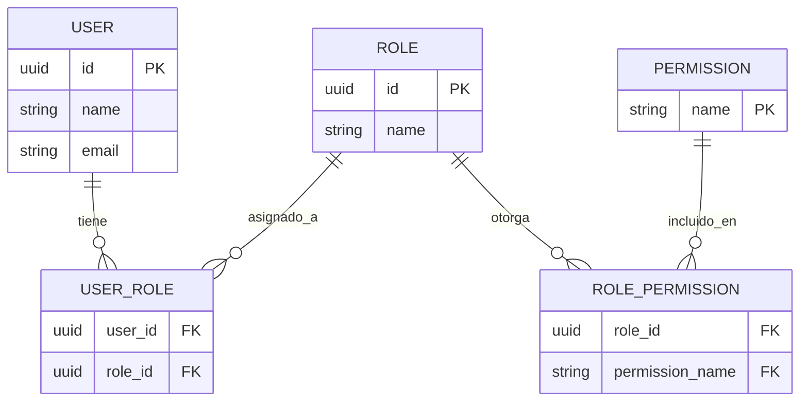

# Arquitectura-Grupo2
# Mini Marketplace Cloud - Identidad, Usuarios y Sesiones

API REST del Grupo 2. Gestiona autenticación, usuarios, sesiones, roles y permisos.

## Estado del proyecto
🟡 En desarrollo - Mock disponible para integración temprana

## URLs disponibles
- Mock (WireMock Cloud): https://grupo2-identidadusuario.onrender.com/docs
- Servidor real (cuando esté listo): https://api-grupo2.onrender.com/api/v1

## Endpoints principales

| Método | Ruta | Descripción |
|--------|------|-------------|
| POST | /auth/register | Registrar usuario |
| POST | /auth/login | Iniciar sesión |
| POST | /auth/logout | Cerrar sesión |
| GET | /users | Listar usuarios |
| GET | /users/{userId} | Obtener perfil |
| GET | /identity/roles | Listar roles |

Contrato completo: ver `openapi.yaml` en este repo.

# Identity Service Mock

## Modelo de Datos

## Autenticación
Los endpoints protegidos requieren header:
