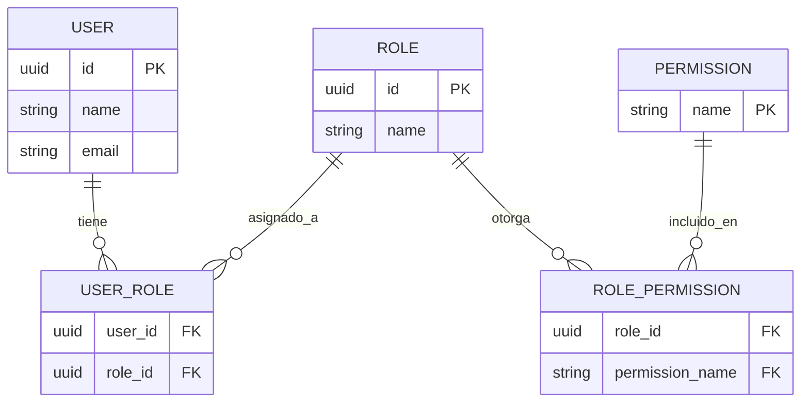

# Mini Marketplace Cloud - Grupo 2
## Servicio de Identidad, Usuarios y Sesiones

API REST del Grupo 2. Gestiona autenticación, usuarios, sesiones, roles y permisos.

## Estado del proyecto
🟡 En desarrollo - Mock disponible para integración temprana

## URLs disponibles
- Documentación Swagger: https://grupo2-identidadusuario.onrender.com/docs
- URL Base del Mock: https://grupo2-identidadusuario.onrender.com

## Endpoints principales

| Método | Ruta | Descripción |
|--------|------|-------------|
| POST | /auth/register | Registrar usuario |
| POST | /auth/login | Iniciar sesión |
| POST | /auth/logout | Cerrar sesión |
| GET | /users | Listar usuarios |
| GET | /users/{userId} | Obtener perfil |
| GET | /identity/roles | Listar roles |

Contrato completo: ver `openapi.yaml` en este repo.

# Identity Service Mock

## Modelo de Datos



## Autenticación
Los endpoints protegidos requieren header:

## Roles del Sistema

| Rol | Descripción |
|------|-------------|
| guest | Usuario no autenticado |
| customer | Cliente que realiza compras |
| seller | Usuario que publica y administra productos |
| admin | Administrador del sistema |

## Tecnologías Utilizadas

- Python 3
- FastAPI
- Uvicorn
- Swagger / OpenAPI
- Render
- Mermaid

## Respuestas HTTP Utilizadas

| Código | Significado |
|----------|----------|
| 200 | Operación exitosa |
| 201 | Recurso creado correctamente |
| 204 | Operación exitosa sin contenido |
| 400 | Solicitud inválida |
| 401 | No autenticado |
| 404 | Recurso no encontrado |
| 500 | Error interno del servidor |

## Integración con Otros Servicios

Este servicio proporciona funcionalidades de identidad para los demás módulos del Marketplace:

- Frontend / BFF
- Pedidos
- Reportería
- Seguridad
- Auditoría

## Ejemplo de Respuesta

### POST /auth/refresh

```json
{
  "access_token": "new-jwt-mock",
  "refresh_token": "new-refresh-mock",
  "token_type": "Bearer",
  "expires_in": 3600
}
```

## Ejecución Local

```bash
pip install -r requirements.txt
uvicorn app.main:app --reload
```

Acceder a:

http://localhost:8000/docs

## Equipo

Grupo 2 - Identidad, Usuarios y Sesiones

Mini Marketplace Cloud

UTEM 2026
